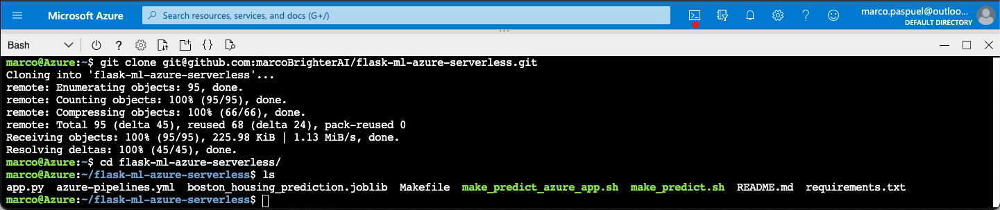
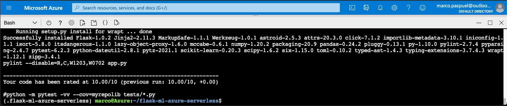
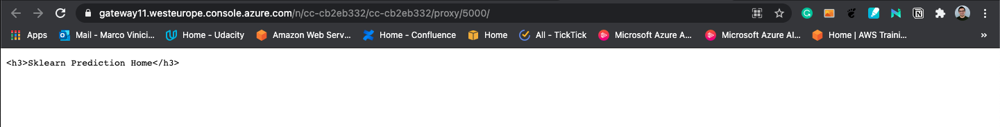
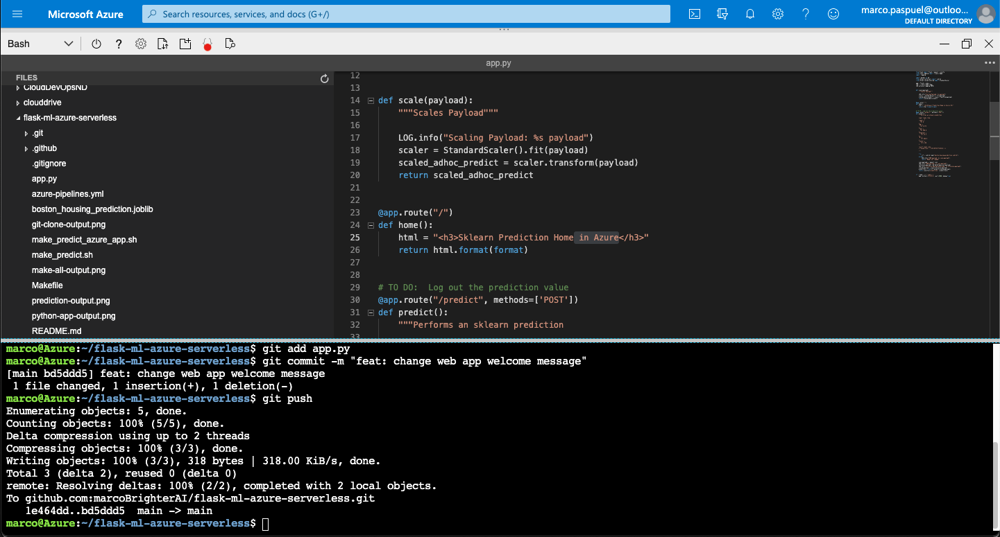
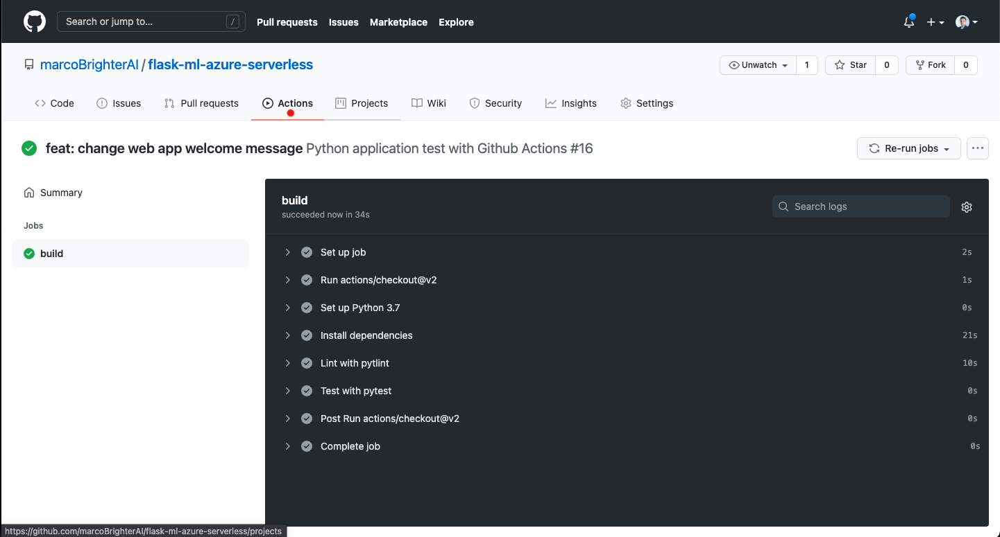
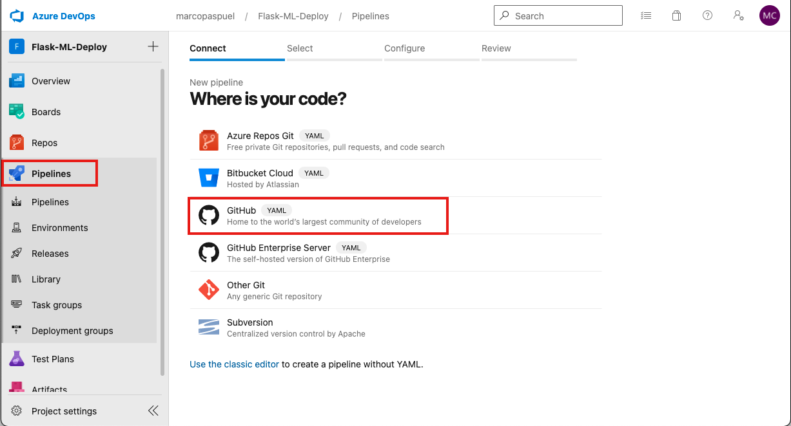
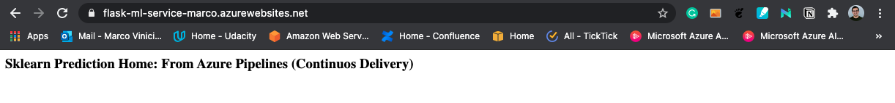
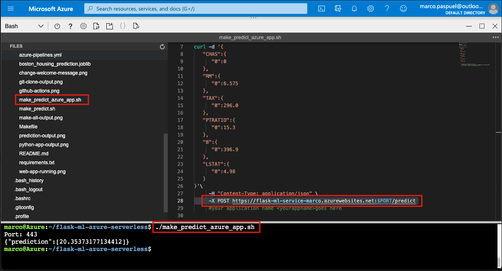
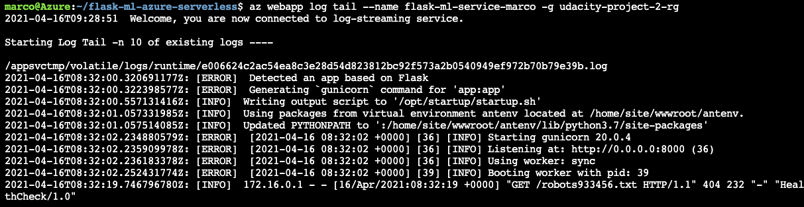

# CI/CD Pipeline for Machine Learning Project in Azure
Deploying a Flask Machine Learning Application on Azure App Services.

### Status

[](https://github.com/marcoBrighterAI/flask-ml-azure-serverless/actions/workflows/main.yml)

### Introduction
This project builds a **Continuous Integration** pipeline using **GitHub Actions**, and a **Continuous Delivery** pipeline
using **Azure Pipelines** for a Machine Learning Application. The app is implemented in python using scikit-learn and the
flask module. **Azure App Services** is used to host the application. In this repo you will find all the code and configurations
necessary to implement CI/CD. The ML application is simple, however, it can be easily extended.


### Dependencies
- [Azure Account](https://portal.azure.com) 
- [Azure command line interface](https://docs.microsoft.com/en-us/cli/azure/install-azure-cli?view=azure-cli-latest) (Only if running locally)
- [Azure DevOps Account](https://dev.azure.com/) 

### Project Plan
To follow DevOps best practices, in the links bellow you will find a Kanban Trello board, and a spreadsheet
showing the project plan, deliverables and goals.

* Trello board
* Project plan spreadsheet

### Getting Started

1. Fork this repository
2. Log into the [Azure Portal](https://portal.azure.com) 
3. Launch Azure Cloud Shell 

### Instructions
To run this project in the Azure Cloud Shell, follow the steps bellow. The same steps apply when running locally, however,
you would need to log into your Azure Account from the terminal first.

1. Clone the forked repo in Azure Cloud Shell
2. Create virtual environment and source
3. Deploy your app in Azure Cloud Shell
5. Verify Machine Learning predictions works
6. Verify Continuous Integration by changing app.py
7. Create a Webapp in Azure App Services
8. Create an Azure DevOps Project and connect to Azure
9. Create a Python Pipeline with GitHub Integration
10. Verify Continuous Delivery by changing app.py


#### 1. Clone the forked repo in Azure Cloud Shell
``` bash 
    git clone git@github.com:marcoBrighterAI/flask-ml-azure-serverless.git
    cd flask-ml-azure-serverless/
    ls
```


Note:  You make need to follow this YouTube video guide on how to [setup SSH keys and configure Azure Cloud Shell with Github](https://www.youtube.com/watch?v=3vtBAfPjQus).

#### 2. Create virtual environment and source
``` bash 
    make setup
    source ~/.flask-ml-azure-serverless/bin/activate
```
#### 3. Deploy your app in Azure Cloud 
To start the app run the following commands:
``` bash 
    make all
    python app.py
```


After running both commands you should see an output like the screenshot bellow.


Now you can open the *Web preview* by clicking in the icon depicted with the red dot in the image above and set the port to `5000`.
A new window will open, and you should see you web app running. See image bellow.


#### 5. Verify Machine Learning predictions works
First open a new Azure Cloud Shell then run the commands bellow.
``` bash 
    cd flask-ml-azure-serverless/
    ./make_predict.sh
```
The model should predict the output depicted bellow.


#### 6. Verify Continuous Integration by changing app.py
To verify that the Continuous Integration is working you can open the editor in Azure Cloud Shell and change the welcome
message in the app.py script (line 25). Then commit and push your changes. 



Now you can you open your GitHub repo and go to the *Actions* section. You will see that a new pipeline has been triggered.
The pipeline will test your changes and make sure that the code is in a deployable state. See image bellow.



#### 7. Create a Webapp in Azure App Services
###### 7.1. Create a Resource Group
``` bash
    az group create --name "RESOURCE_GROUP_NAME" --location "LOCATION" --tags udacity=udacity-project2
```
7.2. Set the default resource group and region for subsequent commands
``` bash
    az configure --defaults group="RESOURCE_GROUP_NAME" location="LOCATION"
```
7.3. Run the following command to create and deploy the App Service app. Replace <your_app_name> 
with a unique name that becomes the URL, http://<your_app_name>.azurewebsites.net.
``` bash
    az webapp up --name <your_app_name> --logs --launch-browser
```
For additional information of how to create an App service click on the links bellow:
- [Create App Service with Azure CLI](https://docs.microsoft.com/en-us/azure/developer/javascript/tutorial/tutorial-vscode-azure-cli-node/tutorial-vscode-azure-cli-node-03) 
- [Create App Service from the Azure Portal](https://medium.com/@nasreddine.skandrani/deploy-from-visual-studio-code-to-azure-bb5a25059339)

#### 8. Create an Azure DevOps Project and connect to Azure
The screenshots below show the steps, but if you need to, you can also refer to [the official documentation for more detail](https://docs.microsoft.com/en-us/azure/devops/pipelines/ecosystems/python-webapp?view=azure-devops#create-an-azure-devops-project-and-connect-to-azure).

8.1. In a browser, go to [dev.azure.com](https://dev.azure.com/). Once you sign in, the browser will display your Azure DevOps
dashboard.

8.2. Create a new project and name it


8.3 Set up a new service connection via Azure Resource Manager and Pipeline


#### 9. Create a Python Pipeline with GitHub Integration
***Important:*** This project contains an azure-pipelines.yml already configure, therefore, we will rename it and use it as reference
to configure the new pipeline.

9.1. To rename the file run the command bellow in the project directory.
``` bash
    mv azure-pipelines.yml azure-pipelines-old.yml
```

9.2. Select Pipelines, create a new one and add GitHub Integration



9.3. Configure Python to Linux Web App Azure


This process will create a new YAML file that looks roughly like the azure-pipelines.yml provided with this project.

9.4. Modify the azure-pipelines.yml file based on the file provided with this project. 

If you need to, you can also refer to [the official documentation](https://docs.microsoft.com/en-us/azure/devops/pipelines/ecosystems/python-webapp?view=azure-devops#create-a-python-specific-pipeline-to-deploy-to-app-service),
and to the official [Azure Pipeline YAML documentation](https://docs.microsoft.com/en-us/azure/devops/pipelines/ecosystems/python-webapp?view=azure-devops#yaml-pipeline-explained) 
for more information about it.

#### 10. Verify Continuous Delivery by changing app.py
To verify that the Continuous Delivery is working you can open the editor in Azure Cloud Shell and change the welcome
message again in the app.py script (line 25).

Note: You will need to pull the changes first before committing and pushing. See image bellow.


After pushing the changes you can go back to [dev.azure.com](https://dev.azure.com/). Select your project, and then select
*Pipelines*. You will see that a new deployment has been triggered. 


Once the deployment is done you can open the URL http://<your_app_name>.azurewebsites.net to see the changes. 



Now we can use this URL to run predictions. To do so, you can open the make_predict_azure_app.sh bash script and replace 
line 28 to match your app URL. Then run the following command.
``` bash 
    ./make_predict_azure_app.sh
```
See image bellow and verity you get the same output.



You can stream the logs from your running application with the following command.
``` bash 
    az webapp log tail --name <your_app_name> -g "RESOURCE_GROUP_NAME"
```



<TODO:  
* Architectural Diagram (Shows how key parts of the system work)>

<TODO:  Instructions for running the Python project.  How could a user with no context run this project without asking you for any help.  Include screenshots with explicit steps to create that work. Be sure to at least include the following screenshots:

* Project running on Azure App Service

* Project cloned into Azure Cloud Shell

* Passing tests that are displayed after running the `make all` command from the `Makefile`

* Output of a test run

* Successful deploy of the project in Azure Pipelines.  [Note the official documentation should be referred to and double checked as you setup CI/CD](https://docs.microsoft.com/en-us/azure/devops/pipelines/ecosystems/python-webapp?view=azure-devops).

* Running Azure App Service from Azure Pipelines automatic deployment

* Successful prediction from deployed flask app in Azure Cloud Shell.  [Use this file as a template for the deployed prediction](https://github.com/udacity/nd082-Azure-Cloud-DevOps-Starter-Code/blob/master/C2-AgileDevelopmentwithAzure/project/starter_files/flask-sklearn/make_predict_azure_app.sh).
The output should look similar to this:

```bash
udacity@Azure:~$ ./make_predict_azure_app.sh
Port: 443
{"prediction":[20.35373177134412]}
```

* Output of streamed log files from deployed application

> 

## Enhancements

<TODO: A short description of how to improve the project in the future>

## Demo 

<TODO: Add link Screencast on YouTube>


